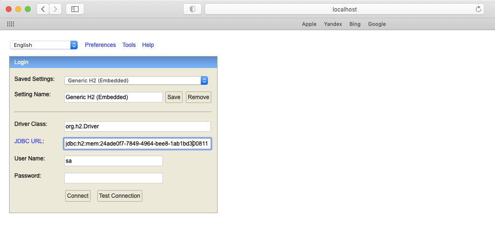

# Meeting

GitHub  

GitHub 

---

**Task description:**

---

Build a simple application to support meeting room reservation inside a company, knowing that:
A company can have multiple buildings, these can have multiple floors which in turn can have multiple meeting rooms.
Meeting rooms have maximum allocation.
Only some rooms have multimedia capabilities.
Rooms have a clean-up time proportional to their size (5 minutes base + 1 min per room seat).
By supplying the start date and meeting time span, number of attendees and required multimedia capabilities the user should be able to reserve a meeting room from a list of available rooms. Result list should be ordered based off efficiency of allocation. Specifying the building is optional.

User should be able to view/list reserved time spans per room for all buildings on any day.

Any object-oriented language of choice may be used, but Java is preferred.
Pre-setup of data is advised, with multiple buildings, floors and rooms with varying allocation limits.
UI is not required nor advised.
Adding test coverage to your implementation will be valued.

---

***Test coverage:***

**Details:**

In order to facilitate the testing process from your side, I used
*H2* database. Instead of it is possible to use any other kind of relational
database management system (*PostgreSQL*, *etc...*).

***DB Schema (created with the help of [sqlDBM](https://app.sqldbm.com/PostgreSQL/Draft/)):***

The *H2* database is available from [Link](http://localhost:8080/h2-console) (after running spring boot application)

Then find *JDBC URL* inside server logs:

and paste this value into the *JDBC URL* field

**API**

*Swagger (after running spring boot application)*:

- JSON API Docs: http://localhost:8080/v2/api-docs

- Swagger UI: http://localhost:8080/swagger-ui.html

Postman:

- Import [Meeting.postman_collection.json](Meeting.postman_collection.json) file into your Postman client